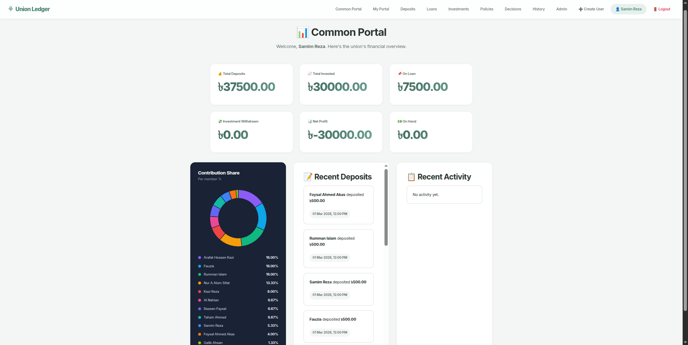
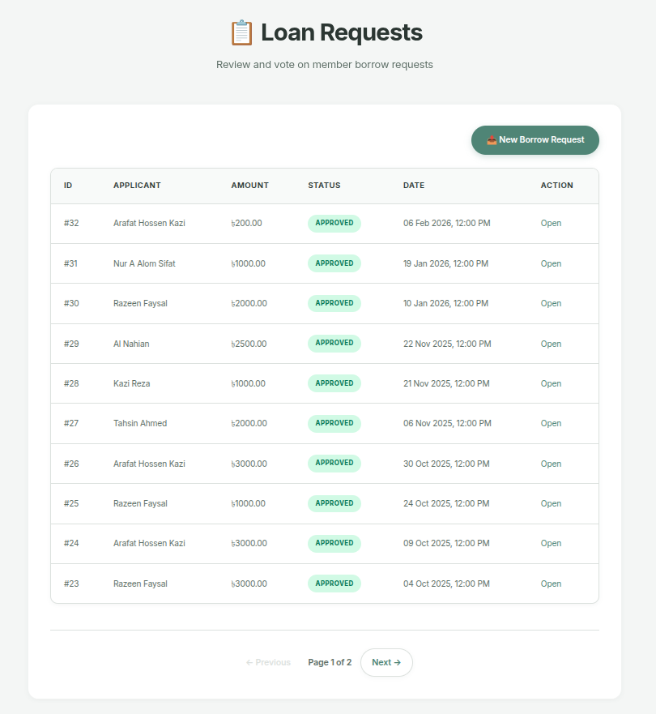
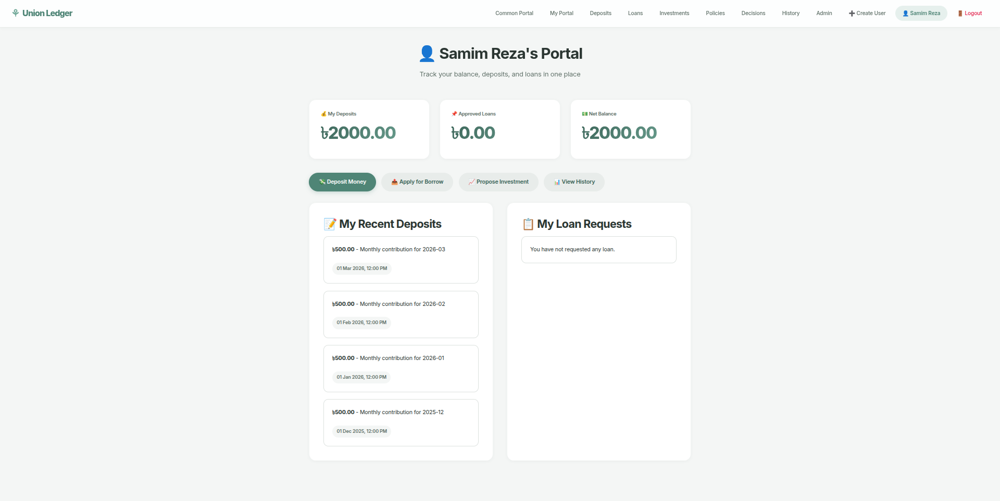

# Union Ledger (Django + PostgreSQL)

*A collaborative financial tracking web application for a friends' union to manage deposits, loans, investments, and collective decisions.*



## Overview

Union Ledger is a specialized financial platform designed to manage the money pool of a small, closed group. It ensures complete transparency and democratic decision-making by requiring member consensus (voting) on every financial action, including deposits, loan approvals, repayments, and investments.

### Key Screens

| Decisions Page | Loan Management | Personal Portal |
| :---: | :---: | :---: |
|  |  |  |

## Features

- **Consensus-Based Approvals**: Everything requires a majority vote.
- **Deposit Tracking**: Submit deposits with receiver tracking and approval voting.
- **Loan Management**: Members can request loans, which are voted on and tracked through repayment workflows.
- **Investment Module**: Track external investments, voting on investment decisions, and recording returns vs. investments.
- **Unified Decisions Hub**: Centralized "Decisions" page showing all pending items (deposits, loans, repayments, investments) that require your vote.
- **Real-Time Financial Dashboard**: View absolute group metrics—Net Profit, On Hand, Total On Loan, and Total Invested.
- **Role-based Admin Actions**: Special permissions for admins (`samim`, `arafat`) to perform cleanup, user management, and activity pruning.
- **Activity Timeline**: Full, transparent chronological history of all union events.

## Project Structure

```text
union/
├── core/                   # Main Django app
│   ├── migrations/         # Database migrations
│   ├── templates/core/     # HTML templates (Dashboard, Forms, Portals)
│   ├── forms.py            # ModelForms and validation logic
│   ├── models.py           # Database schema & properties
│   ├── urls.py             # Route definitions for core features
│   └── views.py            # Business logic and request handlers
├── ui_ux/                  # UI design references and screenshots
├── union_project/          # Django project configuration
│   ├── settings.py         # Global project settings (DB, installed apps, static files)
│   ├── urls.py             # Core URL routing
│   └── wsgi.py             # Server gateway interface for deployment
├── manage.py               # Django execution script
├── requirements.txt        # Python dependencies
└── render.yaml             # Render deployment configuration
```

## Database Schema

Union relies on a relational schema powered by PostgreSQL. Most models extend a base `TimeStampedModel`.

- **User** / **Profile**: Standard Django User linked 1-to-1 with a personal Profile (tracking Data of Birth, etc.).
- **Deposit**: Tracks money added to the union by a user.
- **DepositVote**: Captures member approvals/rejections for a given deposit.
- **LoanRequest**: Records a member's request to borrow money from the pool, including purpose and amount.
- **LoanVote**: The decision logic corresponding to a Loan Request.
- **LoanRepayment**: Tracks when a user pays back part or all of their loan.
- **RepaymentVote**: Member verification that the repayment was received.
- **InvestmentDecision**: Logs money deployed outside the union for profit, alongside the expected or returned amounts.
- **InvestmentVote**: Consensus logic for sanctioning an investment.
- **ActivityLog**: An append-only historical ledger indicating who did what and when.

## Tech Stack

- **Backend**: Python, Django 5.x
- **Database**: PostgreSQL (Neon Serverless)
- **Deployment**: Render (App), GitHub Pages (Routing/Redirects - `index.html`)
- **Web Server**: Gunicorn
- **Static Files**: WhiteNoise

## Local Setup

1. **Create and activate a virtual environment:**
```bash
python -m venv .venv
source .venv/bin/activate  # On Windows: .venv\Scripts\activate
```

2. **Install dependencies:**
```bash
pip install -r requirements.txt
```

3. **Configure Environment:**
Copy the template and configure the required keys.
```bash
cp .env.example .env
```

4. **Database Migration:**
```bash
python manage.py migrate
```

5. **Start the local server:**
```bash
python manage.py runserver
```

## Environment Variables

Check `.env.example` in the repository root.

**Required in Production:**
- `DJANGO_SECRET_KEY`
- `DEBUG=False`
- `ALLOWED_HOSTS` (e.g., `.onrender.com`)
- `CSRF_TRUSTED_ORIGINS` (e.g., `https://<your-app>.onrender.com`)
- `DATABASE_URL` (Neon PostgreSQL standard connection string)

## Deployment (Render)

This project has built-in Continuous Deployment logic via `render.yaml`. 
- **Build Command**: `pip install -r requirements.txt && python manage.py collectstatic --noinput && python manage.py migrate`
- **Start Command**: `gunicorn union_project.wsgi:application --workers 1 --threads 2 --timeout 120`

*Uptime Note: UptimeRobot ping endpoints are recommended for the Render free-tier to prevent application sleeping.*
